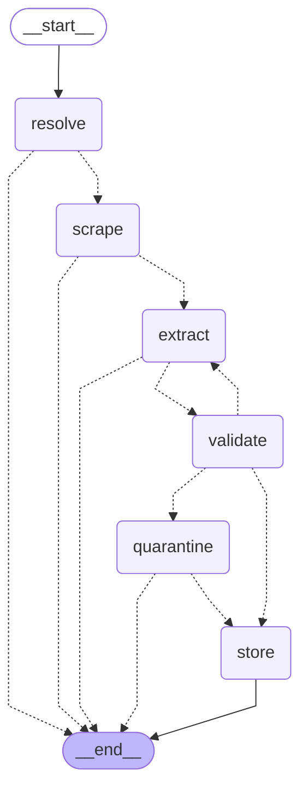

# Workflow graph

Generated from the compiled LangGraph graph in `pipeline/graph.py` by `python -m tools.draw_graph`.
Solid arrows always run; dotted arrows are the routing decisions.

```mermaid
---
config:
  flowchart:
    curve: linear
---
graph TD;
	__start__([<p>__start__</p>]):::first
	resolve(resolve)
	scrape(scrape)
	extract(extract)
	validate(validate)
	quarantine(quarantine)
	store(store)
	__end__([<p>__end__</p>]):::last
	__start__ --> resolve;
	extract -.-> __end__;
	extract -.-> validate;
	quarantine -.-> __end__;
	quarantine -.-> store;
	resolve -.-> __end__;
	resolve -.-> scrape;
	scrape -.-> __end__;
	scrape -.-> extract;
	validate -.-> extract;
	validate -.-> quarantine;
	validate -.-> store;
	store --> __end__;
	classDef default fill:#f2f0ff,line-height:1.2
	classDef first fill-opacity:0
	classDef last fill:#bfb6fc
```
